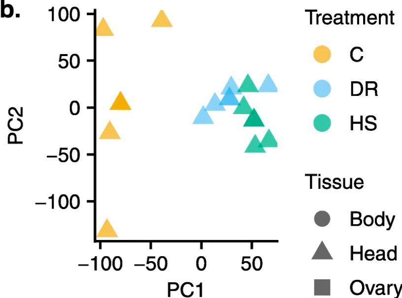
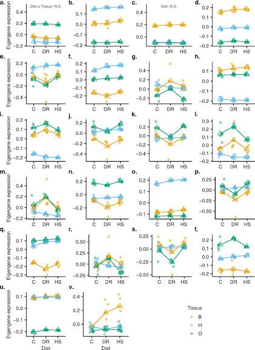

<figure>

<figcaption>A principal components analysis shows the global patterns of gene expression in the different diets in this study for each tissue.</figcaption>
</figure>

[Diverse biological processes coordinate the transcriptional response to nutritional changes in a Drosophila melanogaster multiparent population](https://doi.org/10.1186/s12864-020-6467-6)

Our paper, led by Enoch Ng'oma is out in BMC Genomics today. Our study focuses on understanding the mechanism of gene expression response that is induced by changes in diet. We used the DSPR to identify patterns of female differential gene expression and coexpression in three diets: high sugar (HS), dietary restriction (DR) and control (C); and three tissues: head, body and ovary. Our results indicte that a large number of different genes and pathways are involved in the transcriptional response to diet, and that this response cannot be well-understood by focusing soley on a few key genes.    

<figure>

<figcaption>Patterns of gene expression for different sets of coexpressed genes. Each plot summarized the composite response across diets and tissues for a different set of genes.</figcaption>
</figure>
 
