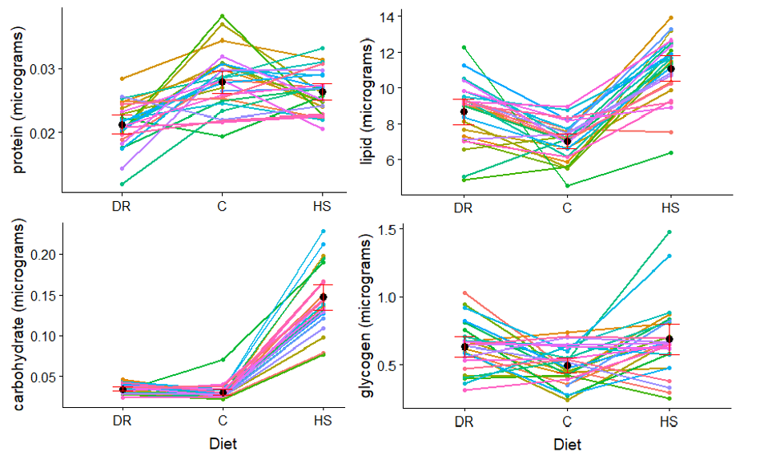

<figure>

<figcaption>Anna and Bella out for a celebratory hike.</figcaption>
</figure>

[Anna Perinchery-Herman](/authors/b1perinchery/) is now officially Anna Perinchery-Herman, Ph.D. Her dissertation focused on understanding the genetic basis and evolution of energy budget components (lipids, carbohydrates, & protien) in different diet conditions. She found some really interesting patterns of variability in these traits accross different diets.

<figure>

<figcaption>Changes in different macromolecule content in different diets in an admixed population derived from the DSPR RILs</figcaption>
</figure>

